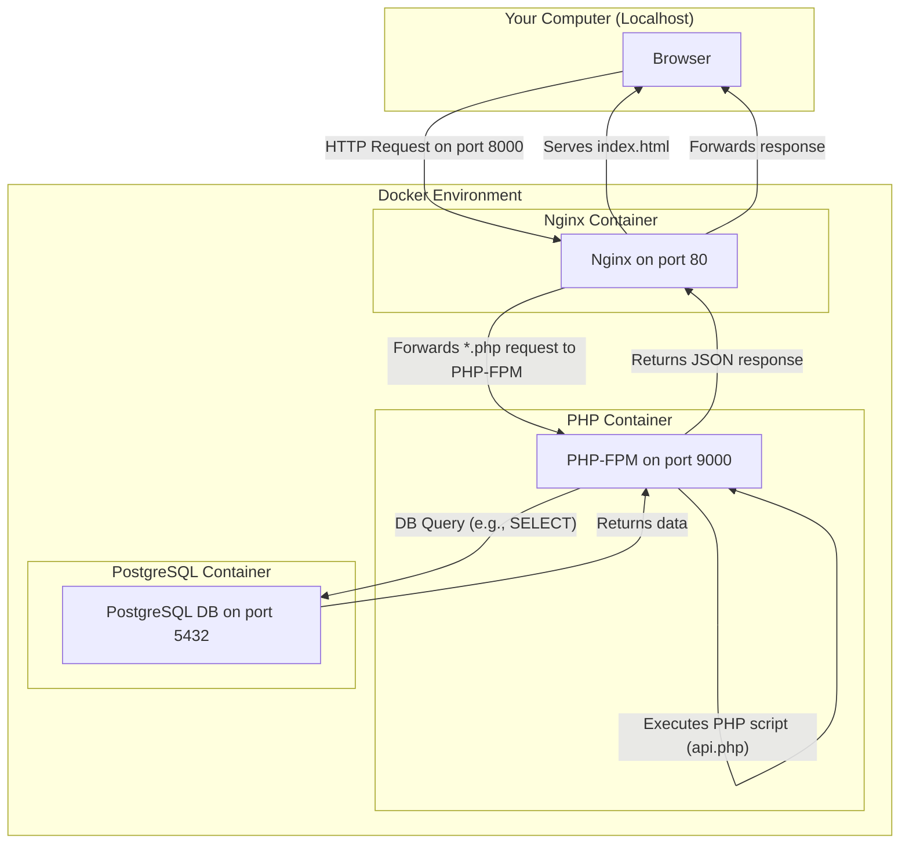

# AJAX Blog

A simple blog platform powered by PHP and PostgreSQL, designed to be served via Nginx and run in a Docker environment. This project uses AJAX calls to interact with the PHP backend.

## Tech Stack

- **Backend:** PHP
- **Database:** PostgreSQL
- **Web Server:** Nginx
- **Containerization:** Docker

## Folder Structure

```
.
├── docker-compose.yml     # Main Docker orchestration file
├── database/
│   └── users.sql          # Initial database schema
└── web_page/
    ├── docker/            # Docker configurations for services
    │   ├── nginx/
    │   └── php/
    ├── public/            # Public web root, accessible to browsers
    │   └── index.php      # Main entry point for the application
    └── src/               # PHP source code and application logic
```

## Getting Started

### Prerequisites

- [Docker](https://docs.docker.com/get-docker/)
- Docker Compose (usually included with Docker Desktop)

### Running the Application

1. Clone or download the project.
2. From the root of the project directory, build and start the services using Docker Compose:

    ```bash
    docker compose up -d --build
    ```

This command will build the custom PHP image and start all the required services (Nginx, PHP, PostgreSQL, and Adminer) in the background.

### Accessing the Services

- **Main Application:** [http://localhost:8000](http://localhost:8000)
- **Database Management (Adminer):** [http://localhost:8080](http://localhost:8080)

To log into Adminer, use the following credentials:
- **System:** `PostgreSQL`
- **Server:** `db` (this is the service name from `docker-compose.yml`)
- **Username:** `user`
- **Password:** `password`
- **Database:** `blog_db`

## Stopping the Application

To stop all running services and remove the containers, run:

```bash
docker compose down
```

## Infrastructure and Architecture

This project is fully containerized using Docker, which means all the services (web server, application backend, database) run in isolated environments called containers. This makes the application portable and easy to set up. Here's how the different components work together:

### The Big Picture: `docker-compose.yml`

The `docker-compose.yml` file is the main orchestration file for this project. It defines all the services and how they are connected. Here's a breakdown of the key parts:

-   **`services`**: This section defines the containers that make up our application:
    -   `db`: The PostgreSQL database container.
    -   `php`: The application backend container, running PHP-FPM.
    -   `nginx`: The web server container, which also acts as a reverse proxy.
    -   `adminer`: A simple database management tool.
-   **`volumes`**: This is how we get our code into the containers and persist data.
    -   `./web_page:/var/www/html`: This mounts the `web_page` directory from your computer into the `/var/www/html` directory in both the `nginx` and `php` containers. This means any changes you make to the code are immediately reflected in the containers.
    -   `pgdata:/var/lib/postgresql/data`: This creates a named volume `pgdata` to store the database data. This ensures that your data is not lost when you stop and remove the containers.
-   **`ports`**: This exposes the services to the outside world (your computer).
    -   `"8000:80"`: This maps port `8000` on your computer to port `80` in the `nginx` container. This is why you access the application at `http://localhost:8000`.
-   **`depends_on`**: This tells Docker the order in which to start the services. For example, the `nginx` service depends on the `php` service, so Docker will start `php` before `nginx`.

### The `php` Service and `Dockerfile`

The `php` service is not a standard, off-the-shelf container. It's built from a `Dockerfile` located at `web_page/docker/php/Dockerfile`. A `Dockerfile` is a set of instructions for building a custom Docker image. In our case, it does the following:

1.  **`FROM php:8.2-fpm`**: It starts with the official PHP 8.2 FPM (FastCGI Process Manager) image. FPM is a more efficient way to run PHP in production environments compared to PHP's built-in server.
2.  **`RUN apt-get update && apt-get install -y libpq-dev`**: It installs the `libpq-dev` package, which is required to install the PostgreSQL driver for PHP.
3.  **`RUN docker-php-ext-install pdo pdo_pgsql`**: It installs the `pdo` and `pdo_pgsql` PHP extensions, which are necessary for our application to communicate with the PostgreSQL database.
4.  **`CMD ["php-fpm"]`**: This is the command that is run when the container starts. It starts the PHP-FPM process, which listens for requests from Nginx.

### The `nginx` Service

The `nginx` service acts as the entry point to our application. It has two main responsibilities:

1.  **Serving static files**: It serves the `index.html` file and any other static assets (like CSS or JavaScript files) directly to the user's browser.
2.  **Proxying PHP requests**: When a request for a `.php` file comes in, Nginx doesn't know how to execute it. So, it forwards the request to the `php` service, which is listening on port `9000`. This is configured in `web_page/docker/nginx/default.conf`.

### Request Flow Diagram

This diagram illustrates how a request from your browser flows through the different services:

